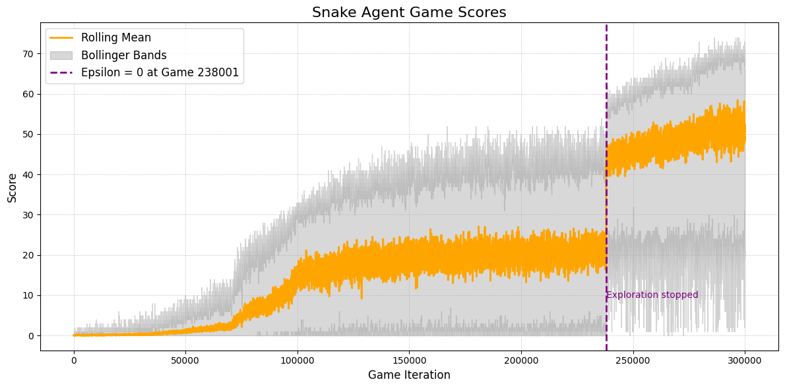

# DDQN-Snake

This project implements a Double Deep Q-Network (DDQN) to master the game of Snake using reinforcement learning techniques. The agent was trained on an 11x11 board, employing a simple convolutional neural network (CNN) to approximate the Q-function.

### Model Architecture

```python
class SimpleCNN(DeepQNet):
    def __init__(self, input_dim):
        # Convolutional layers
        self.conv1 = nn.Conv2d(1, 32, kernel_size=3, stride=1, padding=1)
        self.conv2 = nn.Conv2d(32, 64, kernel_size=3, stride=1, padding=1)
        self.conv3 = nn.Conv2d(64, 64, kernel_size=3, stride=1, padding=1)

        self.flatten_size = 64 * input_dim[0] * input_dim[1]

        # Fully connected layers
        self.fc1 = nn.Linear(self.flatten_size, 128)
        self.fc2 = nn.Linear(128, 64)
        self.fc3 = nn.Linear(64, 4)

    def forward(self, x: np.ndarray):
        # Process input through convolutional and fully connected layers
        # Return output of the network
```

### Training

- The agent was trained using **tinygrad**.
- Epsilon-greedy exploration was used with a floor of 1%. This was set to 0% at game 238001, as due to the number of steps taken by the agent, it became extremely likely that an exploration step would result in the game terminating.



### Results


